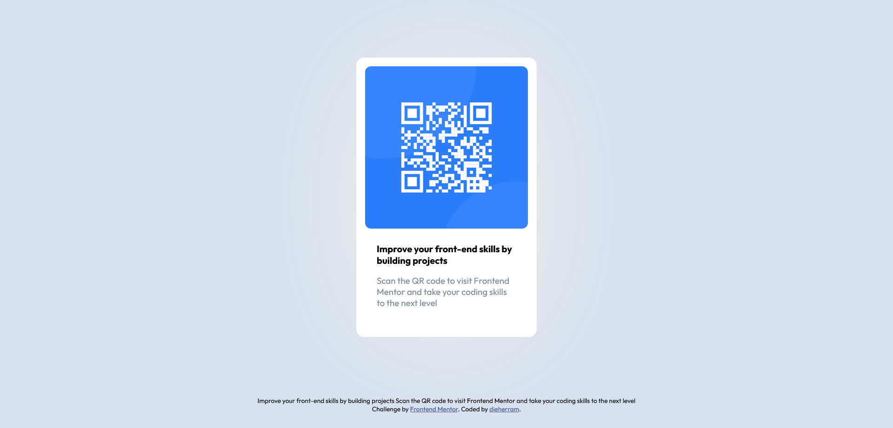

# Desafío QR Code de Frontend Mentor 😎

## Overview

El reto consiste en armar un componente de código QR que se vea lo más parecido posible al diseño original.

### Screenshot

### Links

- Solution URL: (https://github.com/dieherram/fem-qr-code)

## My process

Para este desafío, decidí tomar las cosas por partes. Primero, armé la estructura HTML, luego le di estilo con CSS usando Flexbox.

### Built with

- Semantic HTML5 markup
- CSS custom properties
- Flexbox

### What I learned

En este proyecto, consolidé mis conocimientos de HTML y puse en práctica CSS. ¡Flexbox me salvó la vida! También mejoré mi habilidad para desglosar diseños.

### Continued development

En el futuro, quiero profundizar en el mundo de las unidades de medida responsivas. Ya he jugado con las media queries, pero quiero ser un ninja usando cosas como `em`, `rem` y `%` para hacer diseños que se vean geniales en cualquier pantalla.

## Author

- Github - (https://github.com/dieherram)
- Frontend Mentor - [@dieherram](https://www.frontendmentor.io/profile/dieherram)
- Codewars - [@dieherram](https://www.codewars.com/users/dieherram)
- LinkedIn - (https://www.linkedin.com/in/diego-hernandez-ramos/)

## Acknowledgments

Gracias a Frontend Mentor por desafiarme. 🚀
